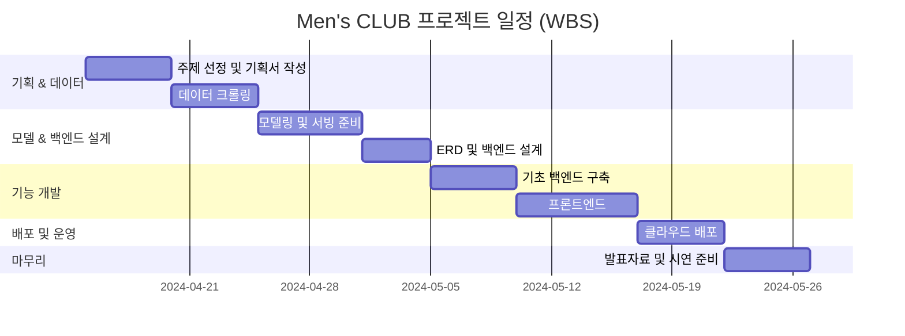

# Men's CLUB 

## AI 기반 코디 추천 서비스 - 패션 초보 2030 남성을 위한 맞춤형 스타일링

- 프로젝트 개요
    - 본 프로젝트는 패션 지식이 부족한 20~30대 남성을 대상으로, 실제 의류 이미지 기반의 AI 코디 추천 서비스를 제공합니다
- 프로젝트 목표
    - 사용자는 자신이 보유한 옷을 기반으로, 최소한의 시행착오로 최적의 코디를 받아볼 수 있습니다.

### 팀원 

<h2>👨‍💻 팀원 소개</h2>

<table>
  <thead>
    <tr>
      <th>이름</th>
      <th>역할</th>
      <th>프로필 이미지</th>
      <th>GitHub</th>
    </tr>
  </thead>
  <tbody>
    <tr>
      <td><strong>황의철</strong></td>
      <td>팀장</td>
      <td></td>
      <td><a href="https://github.com/UICHEOL-HWANG" target="_blank">UICHEOL-HWANG</a></td>
    </tr>
    <tr>
      <td>김민호</td>
      <td>팀원</td>
      <td></td>
      <td><a href="https://github.com/Kkaemii" target="_blank">Kkaemii</a></td>
    </tr>
    <tr>
      <td>박제형</td>
      <td>팀원</td>
      <td></td>
      <td><a href="https://github.com/PJH-02" target="_blank">PJH-02</a></td>
    </tr>
    <tr>
      <td>지용욱</td>
      <td>팀원</td>
      <td></td>
      <td><a href="https://github.com/GitSkyBlue" target="_blank">GitSkyBlue</a></td>
    </tr>
    <tr>
      <td>원예은</td>
      <td>팀원</td>
      <td></td>
      <td><a href="https://github.com/yetk124" target="_blank">yetk124</a></td>
    </tr>
  </tbody>
</table>

### WBS

<!--

**Here are some ideas to get you started:**

🙋‍♀️ A short introduction - what is your organization all about?
🌈 Contribution guidelines - how can the community get involved?
👩‍💻 Useful resources - where can the community find your docs? Is there anything else the community should know?
🍿 Fun facts - what does your team eat for breakfast?
🧙 Remember, you can do mighty things with the power of [Markdown](https://docs.github.com/github/writing-on-github/getting-started-with-writing-and-formatting-on-github/basic-writing-and-formatting-syntax)
-->
