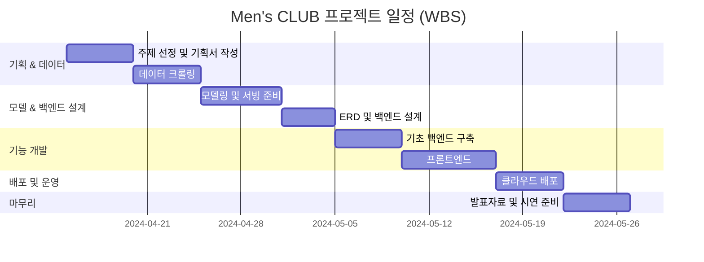

# Men's CLUB 

## AI 기반 코디 추천 서비스 - 패션 초보 2030 남성을 위한 맞춤형 스타일링

 

> Mens-CLUB은 패션 코디에 어려움을 겪는 남성들을 위한 AI 기반 패션 추천 서비스입니다. 멀티모달 AI 모델을 패션 도메인에 특화하여 미세조정하였고, 방대한 패션 데이터베이스를 구축했습니다.

> 사용자가 휴대폰으로 촬영한 의류 사진만으로도 어울리는 코디 아이템을 즉시 추천받을 수 있습니다. 또한 체계적으로 분류된 패션 데이터를 벡터 스토어에 저장하여 유사도 기반 검색을 통해 더욱 정확하고 개인화된 스타일링 솔루션을 제공합니다.

--------

**👔 [Men'sCLUB 서비스 체험하기](https://mensclub-fashion.store)**

- 본 서비스는 비용 문제로 인하여 5월 26일까지만 시범운영 할 예정이오니 참고 부탁드리겠습니다. 

### Project Abstract 

- 프로젝트 개요
    - 본 프로젝트는 패션 지식이 부족한 20~30대 남성을 대상으로, 실제 의류 이미지 기반의 AI 코디 추천 서비스를 제공합니다
- 프로젝트 목표
    - 사용자는 자신이 보유한 옷을 기반으로, 최소한의 시행착오로 최적의 코디를 받아볼 수 있습니다.

## 배경 

- 기획하게 된 배경 : 최근 국내 20-30대 남성층의 자기관리에 대한 관심과 수요가 지속적으로 증가하고 있습니다. 하지만 현재 패션 서비스 시장은 개인 맞춤형 추천보다는 상품 판매에 치중되어 있으며, 기존 패션 플랫폼들은 매니아층 중심의 고난도 콘텐츠로 구성되어 패션 초보자들이 쉽게 접근하기 어려운 상황입니다.

- 이러한 시장의 공백을 해결하고자 누구나 쉽게 사용할 수 있는 개인화된 패션 추천 서비스를 기획하게 되었습니다.

**왜 20-30대 남성인가?**

- 20-30대 남성들은 학창시절 패션에 대한 투자나 관심보다는 부모님이 구매해주는 의류에 의존하며 성장하는 경우가 많습니다. 이로 인해 성인이 되어서도 자신만의 스타일을 찾거나 적절한 패션 매칭을 하는 것에 어려움을 겪는 것이 현실입니다.

- 시장 규모 및 잠재력
 - 이러한 배경을 바탕으로 TAM-SAM-SOM 분석을 통해 시장의 가치와 잠재력을 조사한 결과:
    - 전체 남성 의류 시장 (TAM): 약 15조 원 규모 (2024년 기준)
    - 20-40대 온라인 패션 소비 시장 (SAM): 약 12.1조 원 (월 평균 10만원 × 약 2,287만 명)
    - 패션 초보 20-30대 남성 타겟 시장 (SOM): 약 6,000억 원 (100만 명 × 연 60만원)

**이는 충분한 시장 가치와 성장 가능성을 보여주며, 개인화된 패션 추천 서비스의 필요성을 뒷받침합니다.**

## 기존 패션 서비스 플랫폼과의 차별점 

1. 초보자를 위한 맞춤형 코디 가이드
  - 기존 서비스들은 사용자 특성을 고려하지 않아 진입장벽이 높았지만, Mens-CLUB은 개인별 맞춤 데이터를 활용해 다양한 코디 옵션을 제공하며 실용적인 스타일링 경험을 선사합니다.

2. 간편하고 신속한 추천 시스템
  - 단 한 번의 촬영으로 5분 이내에 완성된 코디 조합을 제안받을 수 있습니다.

3. 합리적 소비 지향
  - 사용자가 보유한 의류를 우선 활용하여 불필요한 과소비를 방지하고, 정말 필요한 아이템만을 추천해 현명한 구매를 돕습니다.

## Data

- 단계별로 목표를 나누어 설정 후, 수집한 데이터를 기반으로 훈련용으로 적합한지에 대한 자체적인 평가를 하여 학습을 진행하였습니다. 

## Use Case 

https://github.com/user-attachments/assets/6dd01a9a-9354-413b-90cf-e4a9cd0a7e86

> 1. 웹서버 접속 -> 바로 로그인창 안내
> 2. 접속 후 메인 페이지에서 다른 사람들이 추천 받았던 내용들과 찜했던 내용들 나열
> 3. 하단 맨 왼쪽에서 AI스타일링 클릭
> 4. 원하는 의류 사진을 촬영 후 확정 클릭 -> 추천 받기
> 5. 의류 카테고리를 인식 받은 후 그에 맞는 의류들을 추천
> 6. 3가지 조합을 [미니멀, 캐주얼] 2가지 스타일로 조합하여 나옴 -> 마음에 들면 찜 버튼(북마크)
> 7. 마이페이지를 통해 조회 가능하며, 내가 추천 받았던 아이템은 익명으로 메인 페이지에 추천 내역을 통해 전시 

## 화면 구성 

- 메인 페이지

- 의류사진 촬영 페이지

- 마이페이지

- 찜(북마크)

- 회원정보 수정

## 👥 팀원 소개

황의철(팀장)|김민호|박제형|지용욱|원예은
:-:|:-:|:-:|:-:|:-:
||||
||||

### 역할 분담 

### WBS

- 최소한의 기능을 우선적으로 구현한 후 이후 팀원들과의 상의를 통해 점진적으로 개발하는 `Agile FrameWork` 기반으로 진행

# Service Architecture

> 주요 아키텍처 정보
> 1. 총 4개의 컴퓨터로 이용
> 2. 웹서버, 로깅서버, 데이터베이스서버, 트래킹서버 4가지로 나누어 각자 독립된 환경에서 작업을 실행할 수 있도록 상호 의존도를 낮춤
> 3. 웹서버는 초기 뼈대 구축 후 바로 배포하며 설정이 추가되거나 버그 발생시 바로 수정할 수 있도록 `CI` 파인프라인 구축
> 4. 모델서버는 `Runpod Serverless` 를 활용하여 고비용 GPU 서버를 필요로 하지 않고 바로 추론할 수 있도록 배치
> 5. 로깅서버는 `Back Server`에서 생길 수 있는 모든 로그를 수집하여 `Logstash`, `Elastic Search` 를 통해 로그를 전송하였고,모델 추론시 발생한 모든 내역을 `Prometheus`, `PushGateWay`(`Serverless`로 인해 로그 수집 연동에 제한이 있어 해당 솔루션을 이용)
> 6. 마지막으로 `mlflow`, `airflow`를 통해 모델의 훈련 매트릭과 오브젝트를 스토리지에 저장, 또한 훈련 주기를 자동화 하는 워크플로우를 구성

# 협업 과정 
- 노션 : 일정표에 따라 `시작전`, `진행중`, `완료`로 나누어 체계적으로 관리하며 어떻게 준비하였고 어떤 인사이트를 얻으며 마무리 했는지를 정리

- 주요 정리 내용 

- 일정 관리

- 오프라인 회의
  - 매일 오전 9시 40분마다 모여 10분간 오프라인 회의를 하며 자신이 생각한 부분을 화이트보드를 활용하여 그려내며 내용을 정리, 협의 후 협의 내용 적용
 

- 주요 회의 내용
  

-----

# 각 프로젝트별 README 보기 

🧠[Model](https://github.com/Mens-Club/Model.git)

💻[Web](https://github.com/Mens-Club/Web.git)

🛠️[Operation](https://github.com/Mens-Club/Web.git)

<!--

**Here are some ideas to get you started:**

🙋‍♀️ A short introduction - what is your organization all about?
🌈 Contribution guidelines - how can the community get involved?
👩‍💻 Useful resources - where can the community find your docs? Is there anything else the community should know?
🍿 Fun facts - what does your team eat for breakfast?
🧙 Remember, you can do mighty things with the power of [Markdown](https://docs.github.com/github/writing-on-github/getting-started-with-writing-and-formatting-on-github/basic-writing-and-formatting-syntax)
-->
