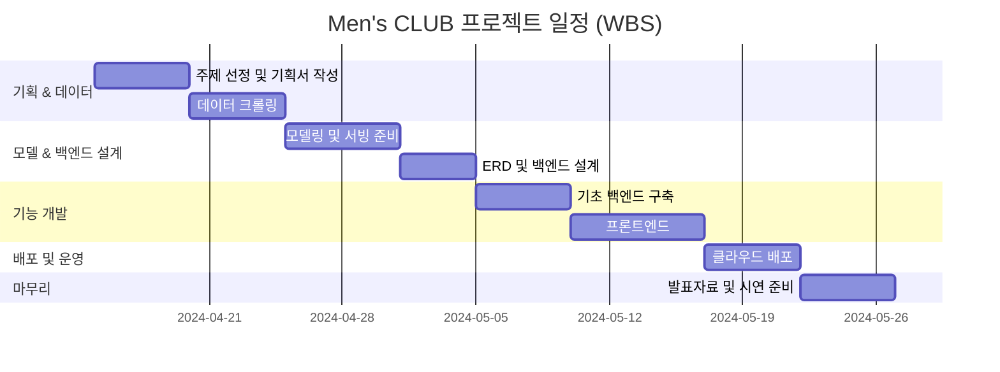

# Men's CLUB 

## AI 기반 코디 추천 서비스 - 패션 초보 2030 남성을 위한 맞춤형 스타일링
 

> Mens-CLUB은 패션 코디에 어려움을 겪는 남성들을 위한 AI 기반 패션 추천 서비스입니다. 멀티모달 AI 모델을 패션 도메인에 특화하여 미세조정하였고, 방대한 패션 데이터베이스를 구축했습니다.

> 사용자가 휴대폰으로 촬영한 의류 사진만으로도 어울리는 코디 아이템을 즉시 추천받을 수 있습니다. 또한 체계적으로 분류된 패션 데이터를 벡터 스토어에 저장하여 유사도 기반 검색을 통해 더욱 정확하고 개인화된 스타일링 솔루션을 제공합니다.

**👔 [Men'sCLUB 서비스 체험하기](https://mensclub-fashion.store)**

- 본 서비스는 비용 문제로 인하여 5월 26일까지만 시범운영 할 예정이오니 참고 부탁드리겠습니다. 

### Project Abstract 

- 프로젝트 개요
    - 본 프로젝트는 패션 지식이 부족한 20~30대 남성을 대상으로, 실제 의류 이미지 기반의 AI 코디 추천 서비스를 제공합니다
- 프로젝트 목표
    - 사용자는 자신이 보유한 옷을 기반으로, 최소한의 시행착오로 최적의 코디를 받아볼 수 있습니다.

### 팀원 

## 👥 팀원 소개

황의철(팀장)|김민호|박제형|지용욱|원예은
:-:|:-:|:-:|:-:|:-:
||||
||||
<!-- 이메일 정보는 원하시면 추가 가능 -->

### WBS

<!--

**Here are some ideas to get you started:**

🙋‍♀️ A short introduction - what is your organization all about?
🌈 Contribution guidelines - how can the community get involved?
👩‍💻 Useful resources - where can the community find your docs? Is there anything else the community should know?
🍿 Fun facts - what does your team eat for breakfast?
🧙 Remember, you can do mighty things with the power of [Markdown](https://docs.github.com/github/writing-on-github/getting-started-with-writing-and-formatting-on-github/basic-writing-and-formatting-syntax)
-->
